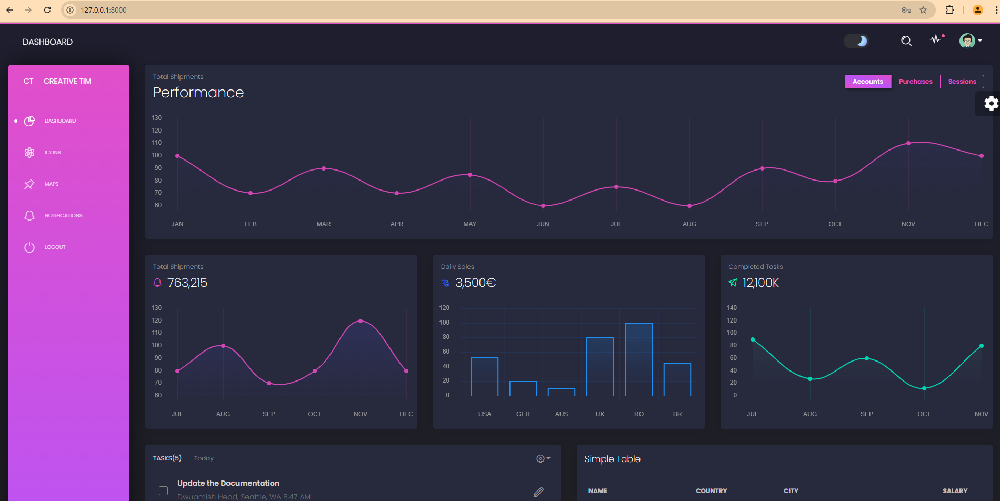
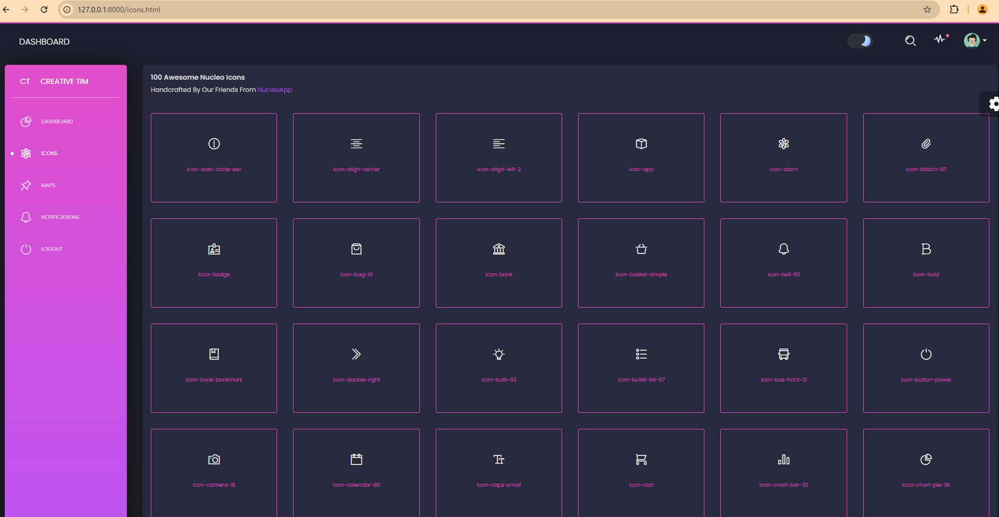
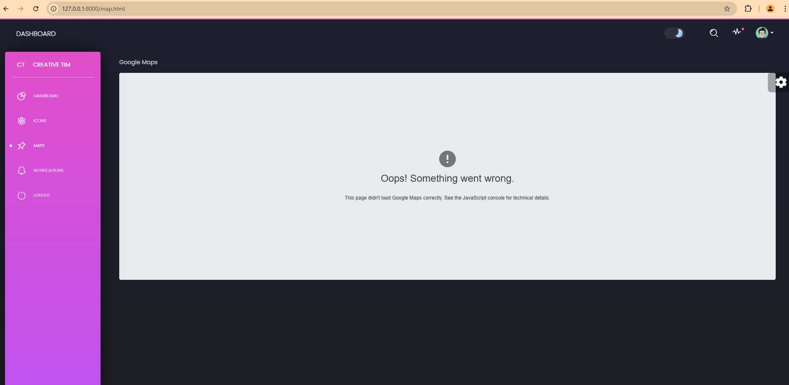
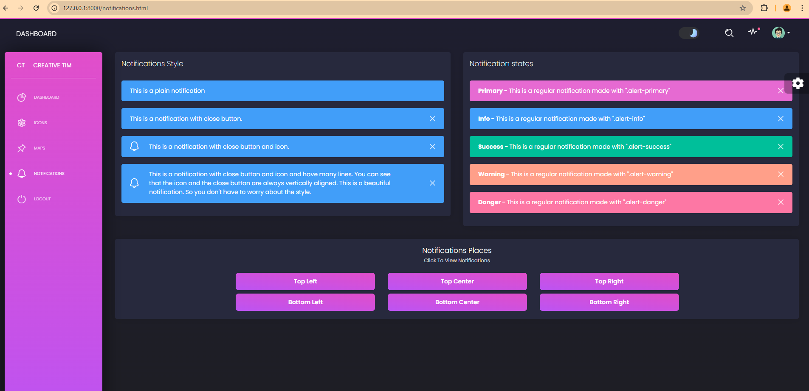

# Lab 1 - Task 2 Setup starter kit on local server

## Task Overview
Setup starter kit and make it run on your local server

## Local Development
- **Local Server URL:** `http://127.0.0.1:8000/`

## Screenshots

### 1. Dashboard

### 2. Icons

### 3. Maps

### 4. Notifications

## Project Dependencies
For a complete list of setup kit, please refer to the [requirements.txt](requirements.txt) file.

## Repository
- **GitHub Repository:** https://github.com/luckyman1025/LNine-Django/