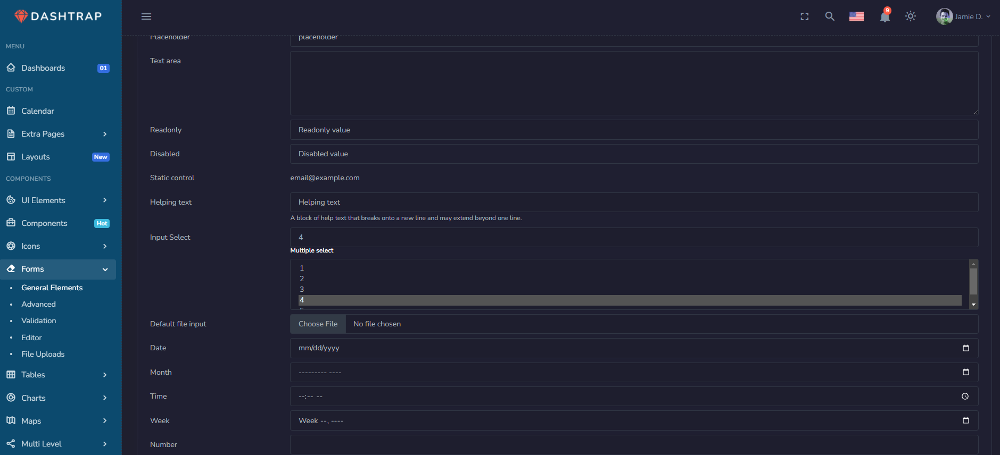

# Lab2: Task1 -  HTML files into a functioning django application

## Project Overview
Download any one of HTML Kit from the following links below and convert it into a functioning DJANGO application

### HTML Kit
- **Source**: [HTML Kit URL](https://www.buzzerboysites.com/html_kits/dashtrap.zip)
- **Type**: Professional UI Kit

## Screenshot

