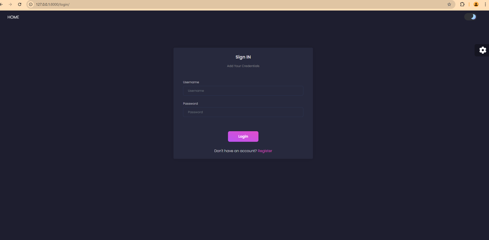
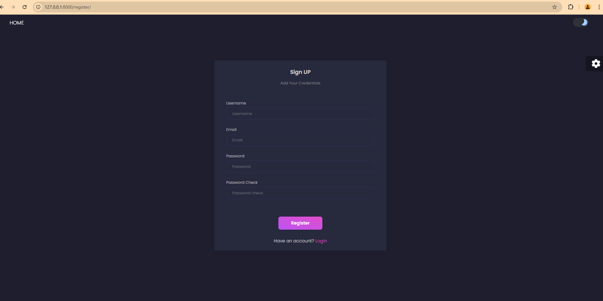
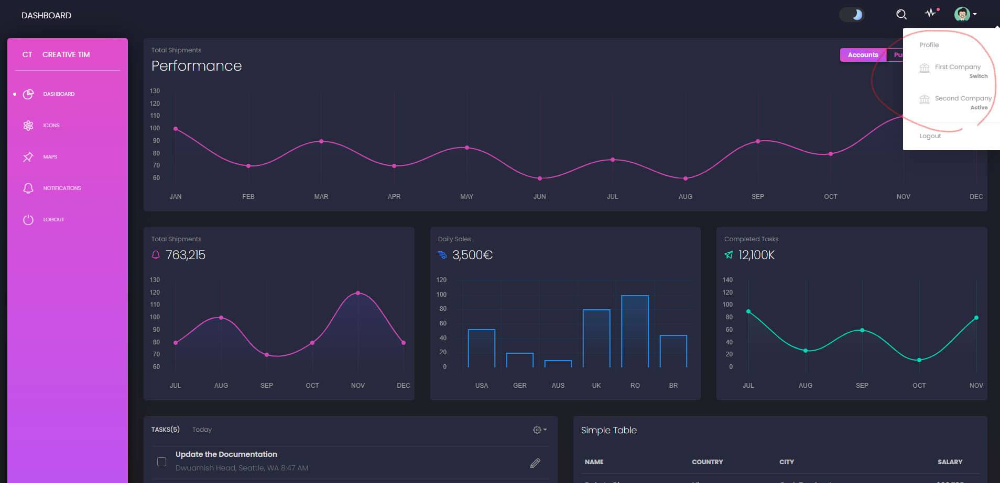

# Lab 2: Authentication and Multi-Profile Functionality

## Authentication Implementation
Implemented user authentication using `django.contrib.auth` with the following features:

### Login Page

### Signup Page

## Multi-Profile Functionality

### UserProfile Model
The `UserProfile` model supports multiple profiles with the following structure:

    class UserProfile(models.Model):

        user = models.ForeignKey(User, on_delete=models.CASCADE)
        company = models.ForeignKey(Company, null=True, blank=True, on_delete=models.CASCADE)
        profile = models.TextField(blank=True)
        is_active = models.BooleanField(default=False)

        class Meta:
            unique_together = ['user', 'company']

        def __str__(self):
            return f"{self.user.username} - {self.company.name}"

### Profile Switching

### Key Features
- Multiple company profiles per user
- Company-specific profiles
- Active/Inactive profile management

## Model Constraints
- Unique constraint on user-company combination
- Optional company association