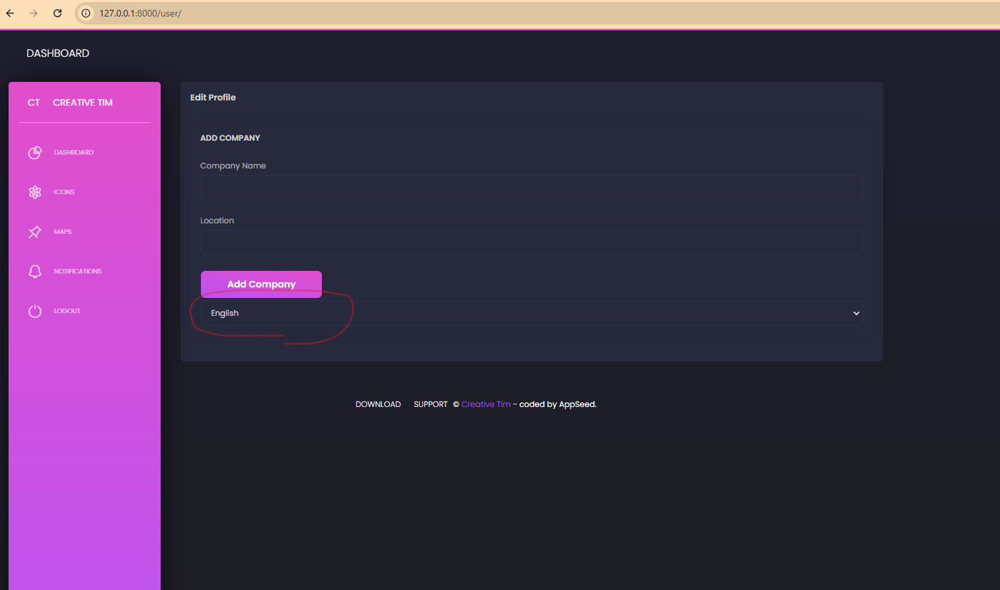
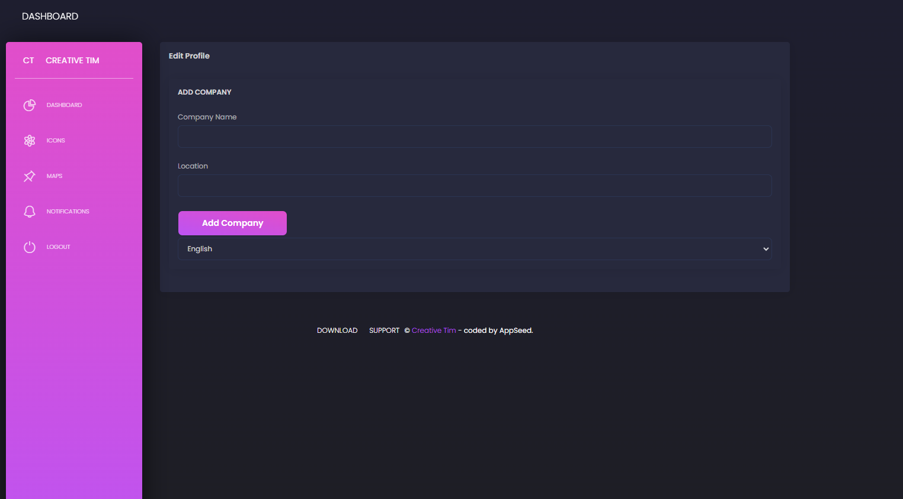
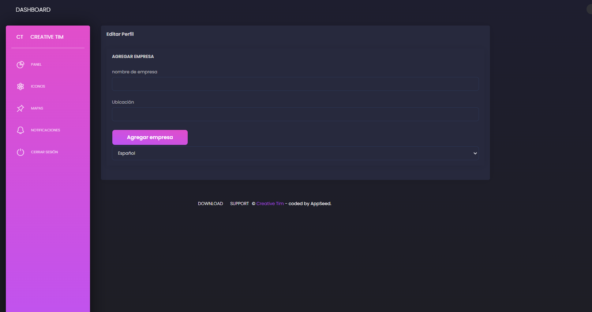

# Lab 2: Implement multilignualism and user profile language

## Task Overview
Implemented the ability for users to switch between languages

### Switch Language

## User Profile Language Functionality

### Updated UserProfile Model
The `UserProfile` model supports multiple profiles with the following structure:

    class UserProfile(models.Model):

        LANGUAGE_CHOICES = [
            ('en', _('English')),
            ('es', _('Spanish')),
        ]

        user = models.ForeignKey(User, on_delete=models.CASCADE)
        company = models.ForeignKey(Company, null=True, blank=True, on_delete=models.CASCADE)
        profile = models.TextField(blank=True)
        is_active = models.BooleanField(default=False)
        language = models.CharField(  # Added language field
            max_length=2,
            choices=LANGUAGE_CHOICES,
            default='en',
            verbose_name=_('language')
        )

        class Meta:
            unique_together = ['user', 'company']

        def __str__(self):
            return f"{self.user.username} - {self.company.name}"

### Profile Language(English)

### Profile Language(Spanish)

### Key Features
- Single Language per user profile